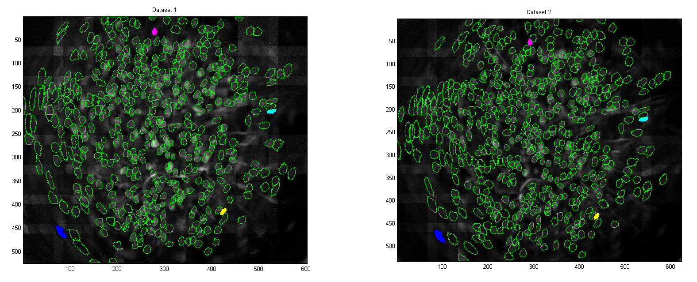
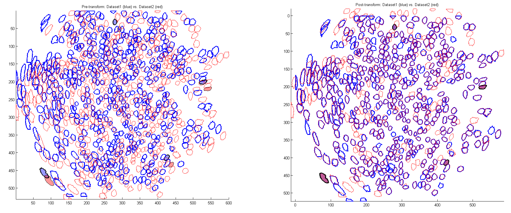

## Cross-dataset alignment using DaySummary

In this tutorial, we assume two `DaySummary` objects (`m1d12` and `m1d13`) that represent the two datasets to be aligned:
```
>> m1d12

m1d12 = 
  DaySummary with properties:
              cells: [1223x1 struct]
             trials: [110x1 struct]
          num_cells: 1223
         num_trials: 110
      trial_indices: [110x4 int32]
    full_num_frames: 13851

>> m1d13

m1d13 = 
  DaySummary with properties:

              cells: [1244x1 struct]
             trials: [155x1 struct]
          num_cells: 1244
         num_trials: 155
      trial_indices: [155x4 int32]
    full_num_frames: 19414
```

The alignment procedure can be invoked as:
```
>> [match_12to13, match_13to12] = run_alignment(m1d12, m1d13);
```

At this point, you are prompted to select 4 pairs of cells from each dataset. (Tip: try to distribute these control points around the field of view.) I find it easiest to alternate clicks between the datasets:


If you mess up with the clicking, you can just Ctrl+C out of the script, and restart. ;)

After you select the 4 pairs of alignment points, the script will show you a pre-transform and post-transform overlay:


At this point, you have to press [Enter] in the console output to proceed with the matching:
```
>> [match_12to13, match_13to12] = run_alignment(m1d12, m1d13);
run_alignment: Beginning alignment...
compute_affine_transform: Please select 4 cells from each dataset (in order)
  Dataset1: Cell 1153 selected (at [80.7 457.9])!
  Dataset2: Cell 1159 selected (at [94.3 478.5])!
  Dataset1: Cell 74 selected (at [278.9 32.7])!
  Dataset2: Cell 72 selected (at [291.7 52.6])!
  Dataset1: Cell 646 selected (at [526.9 201.7])!
  Dataset2: Cell 636 selected (at [540.2 221.1])!
  Dataset1: Cell 1107 selected (at [424.6 414.7])!
  Dataset2: Cell 1109 selected (at [437.4 434.5])!
  All reference cells selected!
run_alignment: Press any key to continue with mask matching >> 
```

The interpretation of the results is as follows. For example:
```
>> match_12to13{23}
ans =
  173.0000    0.7321
```
means that Cell 23 of Day 12 matches to Cell 173 of Day 13, with an "overlap score" (intersection area divided by union area) of 0.7321. By default, `run_alignment` will return up to one match per cell (the one with the highest overlap score). The matches are reciprocal, i.e. `match_13to12{173} = [23.0000 0.7321]` in the above example.

If `match_12to13{k}` is empty, it means that there was no match for Cell k of Day 12 that passed the overlap threshold.

## Additional details on `run_alignment`

Documentation to be filled out.

#### Alignment without spatial transformation

#### Transferring filters across datasets

#### Heuristics used by the matching algorithm
