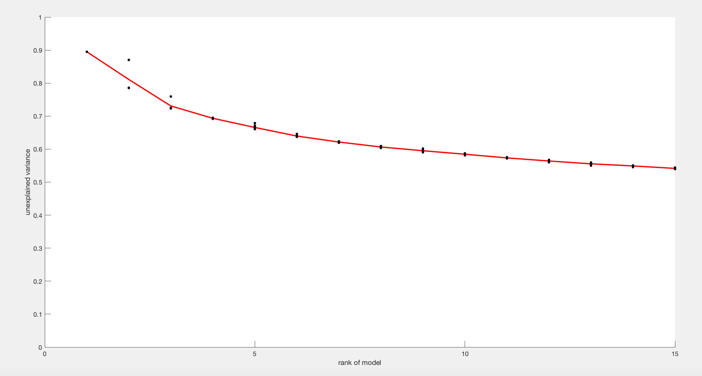
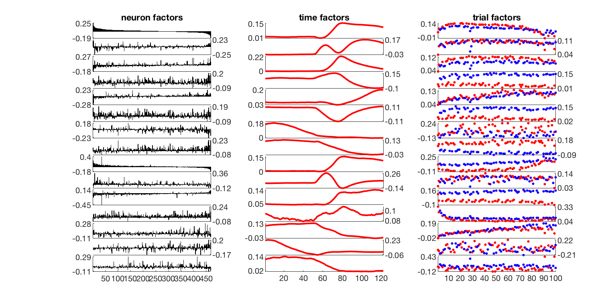
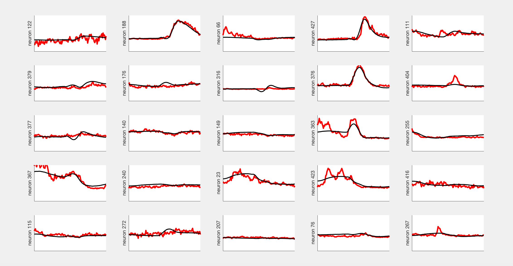
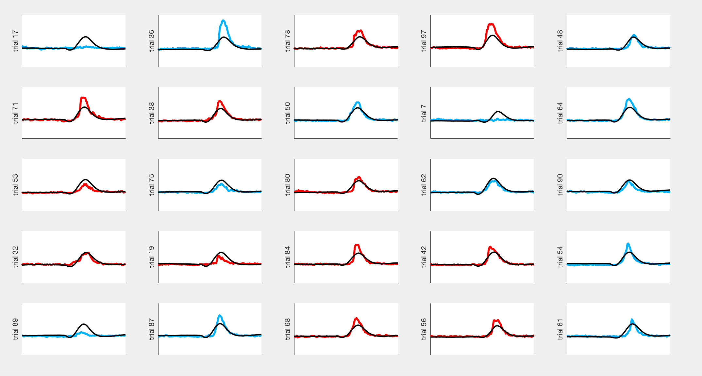
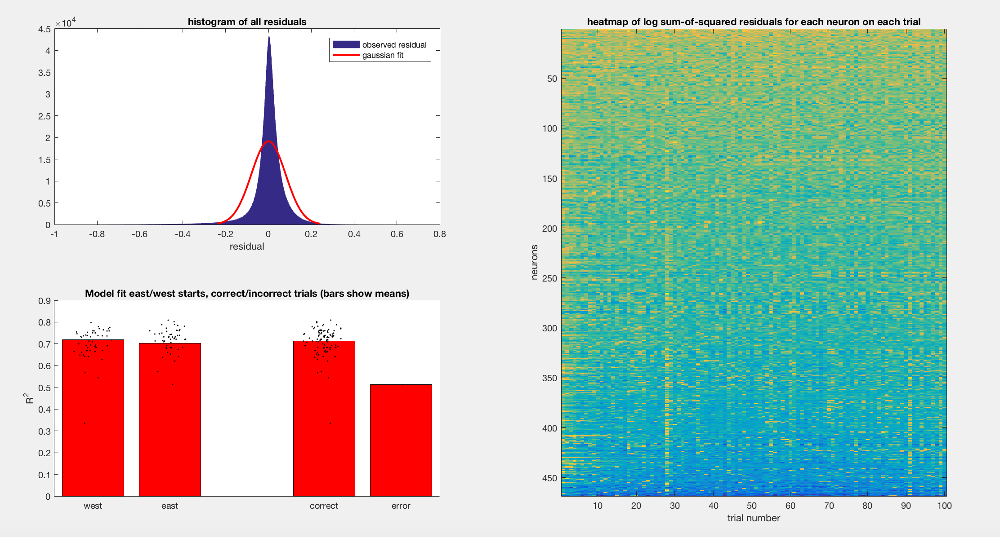
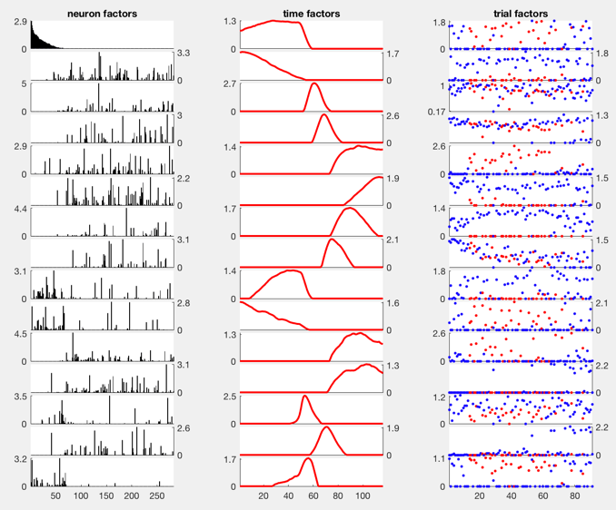

# Tensor decompositions of trial-structured calcium imaging datasets

## Background material

A *tensor* is a higher-order numeric array. The *order* of a tensor is the number of indices/dimensions it holds. In MATLAB, `randn(10,10,10)` creates a tensor of order 3.

There are many tensor decompositions one can try, but the simplest and easiest to interpret is the canonical polyadic decomposition (CPD). We will focus on fitting this decomposition on an order-3 tensor `neurons x intra-trial time x trials`, which gives us three sets of low-dimensional factors/components. The first set of components provides a low-dimensional representation of the neurons, the second set of components provide a representation of the within-trial dynamics of the neurons, and the final set of components provide a representation of how the within-trial dynamics change across trials and days.

[Kolda & Bader (2008)](http://dx.doi.org/10.1137/07070111X) is a good review that covers the more technical details of tensor decomposition.

## Basic Walkthrough

Start by loading data and turning it into a `MultiDay` object named `md`. Refer to `docs/ds_quickstart.md` and `docs/md_quickstart.md`.

The decomposition can take moderately long to fit when taking data from multiple days (particularly the scree plot, explained below) -- it is probably a good idea to start with just one day.
The sections below walks through the demo script and provides brief explanations of each of the generated plots:

#### Converting a `MultiDay` object to a data tensor

The first step is to export data from the `MultiDay` object:

```matlab
[X, trial_meta, info] = export_tensor(md);
```

`X` is a three-dimensional tensor (`[neurons x time x trials]`) that contains the neural activity for all neurons and trials in `md`. Note that:
- Neurons are matched across all trials (including across days), and
- All trials have been "timewarp"-ed to have the same number of samples.

`trial_meta` is a struct array holding the metadata for each trial. For example, `trial_meta.start` is a cell array holding the start location of each trial.

`info` is a struct containing additional information associated with the `export_tensor` run. For example:
- `info.neuron_map` matches the neurons in `X` to their indicies for each day of the `MultiDay`, and
- `info.trial_map` matches the trials in `X` to their `[day, trial_idx_in_day]` indices. 

The `export_tensor` function provides options to filter the trials that are exported. For example, the following will filter out any probe trials (i.e. trials starting in the north or south arms):

```matlab
[X, trial_meta, info] = export_tensor(md, 'start', {'east','west'});
```

#### Normalizing/Standardizing data

From day-to-day there appears to be significant fluctuations in the mean fluorescence of each cell. Additionally the baseline can drift slightly from trial-to-trial. Thus, we normalize the data by the following two steps:

* For every trial, shift each neuron's trace so that it's minimum value is zero
* For every trial, divide each neuron's trace by the max fluorescence value for the neuron observed on that day/session.

This is done with the following function:

```matlab
X = normalize_tensor( X, trial_meta )
```

#### Fitting the CPD model and making a scree plot

Tensor decompositions are non-convex optimization problems and are NP-hard in terms of worst case analysis.
Thus, it is prudent to fit the model with multiple random initializations.
We would like to get a sense of how well fit the model is to the data as a function of model complexity (i.e. we need to determine how many factors to fit to the data).
To do this, we use the `fit_cpd` function:

```matlab
models = fit_cpd(X, 'min_rank', 1, 'max_rank', 15, 'num_starts', 10)
```

This will fit models from 1 factor up to 15 factors, and fit each model from 10 different random initializations.
(In practice, I've reassuringly observed that different initializations produce similar models.)
A 2D-struct array `models` holds the outcome of all optimizations -- `models(:,r).decomp` holds all the rank-`r` CP decompositions sorted from best to worst reconstruction error, and `models(s,r).error` gives a measure of the model reconstruction error:

```
reconstruction_error = norm(model_estimate - data_tensor) / norm(data_tensor)
```

Finally, the similarity of each rank-`r` model to the best-fit rank-`r` model is given by `models(:,r).similarity` (refer to the `score(...)` function in the TensorToolbox).
These results are commonly summarized with a [scree plot](http://support.minitab.com/en-us/minitab/17/topic-library/modeling-statistics/multivariate/principal-components-and-factor-analysis/what-is-a-scree-plot/).
The following command will produce a nicely formatted scree plot, given the struct array of cpd fits:

```matlab
cpd_scree_plot(models);
```



#### Visualizing the factors

Next, let's visualize the factors. For this example, we'll take the rank-15 CPD model with the best (smallest) reconstruction error:
```
cpd = models(1,15).decomp;
```

Each factor in a CPD model is a triplet of three vectors, and the number of factors is the *rank* of the model.
Below, I visualized the factors for a rank 15 model using the command:

```matlab
visualize_neuron_ktensor(cpd, trial_meta, 'start')
```



The left column of plots shows the 15 *neuron factors*.
Because the ordering of the neurons in the data tensor `X` isn't especially meaningful, I've sorted the neurons from highest to lowest on the first factor (i.e the top plot).
The second colum of plots shows the 15 *within trial factors*.
The third column of plots shows the 15 *across trial factors*, with the east and west starts colored in blue and red respectively.

You can change the coloring of the across trial factors (right column) by inputting a string that matches one of the fieldnames in the `trial_meta` struct:

```matlab
visualize_neuron_ktensor(cpd, trial_meta, 'correct') % colors correct vs incorrect trials
visualize_neuron_ktensor(cpd, trial_meta, 'day') % colors by session
visualize_neuron_ktensor(cpd, trial_meta, 'strategy') % colors by inferred navigation strategy
```

The neural, time, trial vectors may be accessed directly as:
```
neuron_vs = cpd.U{1};
time_vs = cpd.U{2};
trial_vs = cpd.U{3};
```
and the singular values via `cpd.lambda`.

#### Visualizing the model fit

It is useful to view the model's prediction and the raw data on the same plot, this can be done with the following commands:

```matlab
% get the full reconstructed tensor from the model
Xest = full(cpd);
Xest = Xest.data;

% plot fit across neurons
visualize_fit(X, Xest, 1, md, info.trial_map);
```

The last command should produce a series of plots that look like this (press the space button to go to the next plot and `Control-C` / `Command-C` to interrupt the program).



This figure plots a single neuron `X(i,:,:)` on 25 random trials.
The raw data is plotted in red/blue traces respectively denoting east/west trial starts.
The model fit is the black trace in all plots.

It is also possible to examine the model fit across all trials, i.e. examining slices through the third mode of the tensor `X(:,:,i)`.

```matlab
% plot fit across trials
visualize_fit(X, Xest, 3, md, trial_map);
```



#### Visualizing the residuals and outlier detection

Another question of interest is whether the model is better fit to some trials or to some neurons more than others.
To look at this we examine the residuals for each neuron, trial phase, and trial (`X(n,t,k) - Xest(n,t,k)`) as well as the squared error `(X(n,t,k) - Xest(n,t,k))^2`.

```matlab
% plot fit across trials
visualize_resids(X, Xest, md, trial_map);
```

Produces a plot like:



## Non-negative Decompositions

Just as [non-negative matrix factorization (NMF)](https://en.wikipedia.org/wiki/Non-negative_matrix_factorization) extends PCA by constraining the loadings/components to be non-negative, we can try fitting non-negative tensor decompositions. The `fit_cpd` contains an option to do this:

```matlab
nn_models = fit_cpd(X, 'method', 'cp_nnals'); % fits 10 non-neg rank 15 cp models
```

Everything else should work as described in the previous section. For example, `visualize_neuron_ktensor` can produce something that looks like this:


