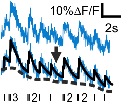

# MLspike

_MLspike_ is an algorithm to reconstruct neuronal spiking activity from noisy calcium recordings. Its description and benchmarking can be found in [(Deneux et al. 2016)](http://www.nature.com/articles/ncomms12190).

### Requirements

_MLspike_ requires the [brick](https://github.com/MLspike/brick) toolbox. Add _MLspike_ and _brick_ folders to the Matlab path, but not their sub-folders.

### Getting started

_MLspike_ takes calcium signals as an input and return spike train estimations. It can optionally return spike probabilities instead of a unique maximum a posteriori spike train, or random spike trains drawn from the a posteriori distribution.

_MLspike_ requires some parameters to be set, in particular those describing the physiological link between spikes and calcium fluorescence dynamics. Some of these parameters can be estimated by a second _autocalibration_ algorithm from the data itself. _This autocalibration algorithm however requires the data to be high-quality_, typically where single-spike transients are clearly identifiable by eye. When working with low or moderate quality recording, users should prefer setting parameters manually or taking values from the litterature (see [Supplemental Figure 6a](https://media.nature.com/original/nature-assets/ncomms/2016/160719/ncomms12190/extref/ncomms12190-s1.pdf) in the _MLspike_ paper).

Setting _MLspike_ parameters requires understanding how each parameter affects the estimation. The best entry point for learning how to use the algorithm is therefore the graphical interface **`spk_demoGUI`** that lets the user try the algorithm on simulation data or its own data and easily check the effect of changing parameter values.

Then it is recommended to follow the script **`spk_demo`** to learn how to call the algorithm and other associated functions. In particular the script first runs MLspike alone, then in combination with the autocalibration algorithms. Matlab-published output of this script can be seen in the 'help' folder.

### Documentation

Main functions are:

    tps_mlspikes         estimate spikes from calcium (note the function spk_est, which is a small wrapper of tps_mlspikes)
    spk_autocalibration  auto-calibration of parameters A, tau, sigma
    spk_autosigma        auto-calibration of parameter sigma
    spk_gentrain         generate simulated spike train
    spk_calcium          generate simulated calcium signal
    spk_display          display spikes and calcium signals together
    spk_calibration      calibration, i.e. estimate the values of physiological parameters based on true spikes and recorded calcium signals

Simulation and estimation run with parameters, default parameters are easily obtained, for example, `par = tps_mlspikes('par');`.
 
Help for each function can be provided by typing `help function_name`.
Additional help can be found in the Help browser: type `doc`, then go to 'Supplemental Software' > 'MLspike toolbox'.
 
### Going further

A more complex script can be studied as well to better understand the algorithms and on which factors their estimation quality depend: **`spk_factorbox`** generates the [Factor Box](https://media.nature.com/original/nature-assets/ncomms/2016/160719/ncomms12190/extref/ncomms12190-s1.pdf) in the _MLspike_ paper. Matlab-published output of this script can also be seen in the 'help' folder.

_MLspike_ has obtained a very good score at the [*Spikefinder*](https://www.biorxiv.org/content/early/2017/08/19/177956) competition. The code used for this competition can be found in the 'SpikeFinder' sub-folder (file `spf_main_script.m`).

           
